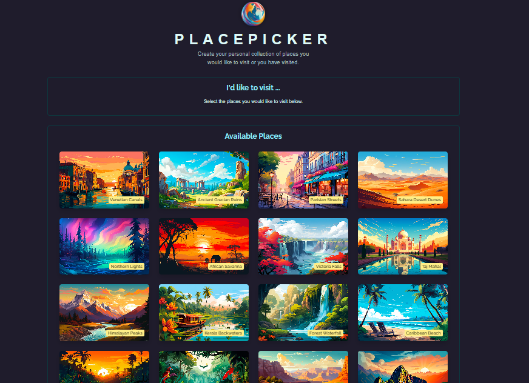
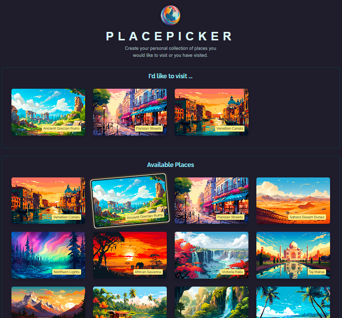
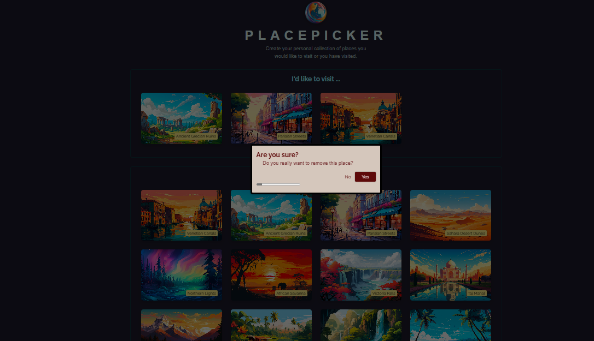

# PLACE PICKER

Future Travel Destinations is a simple web application built with React and Node.js that allows users to browse available travel destinations and save their desired destinations for future reference.

## Features

- **Browse Available Destinations:** Users can explore a list of available travel destinations fetched from a database.
- **Select Desired Destinations:** Users can select destinations they would like to visit in the future and add them to their personal list.
- **User-friendly Interface:** The website features an intuitive and responsive user interface for seamless navigation.
- **Persistent Storage:** The selected destinations are stored securely in a database, ensuring that users can access their saved destinations even after closing the website.

## Technologies Used

- **Frontend:** React.js
- **Backend:** Node.js

### Dashboard:

### Add Place:

### Remove Place:

